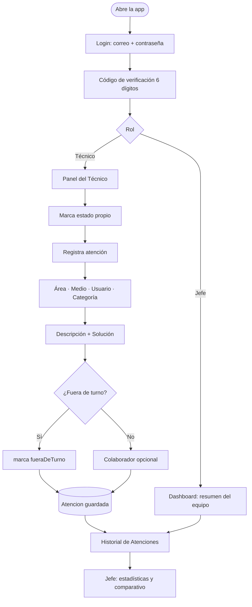
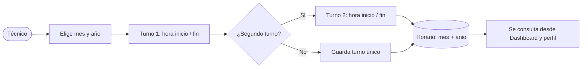
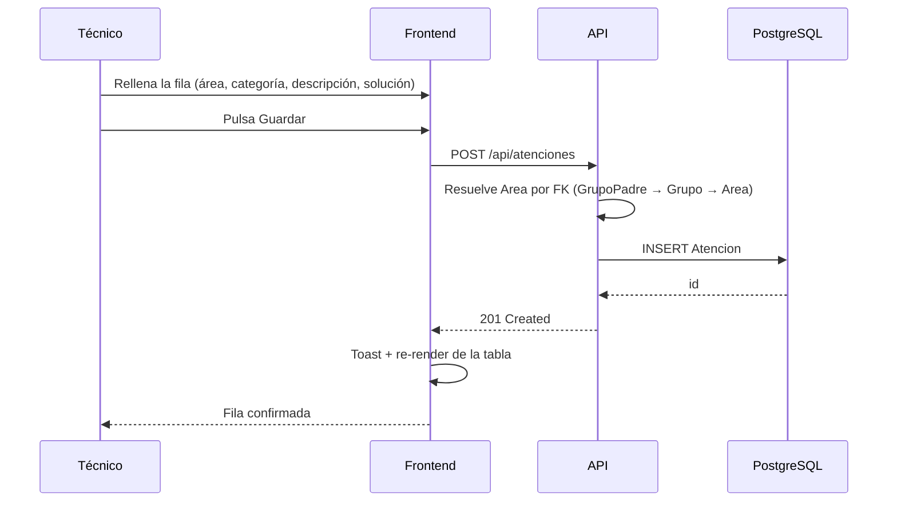

# Flujo de Soporte Técnico — wireframe de flujo

Diagramas del flujo core, previos a cualquier template. Fuente de verdad: los modelos
reales `Atencion` y `Horario` del backend y los controllers existentes
(`AuthController`, `AtencionesController`, `HorariosController`, `DashboardStats`).

> Etapa: **wireframe**. Valida estructura y jerarquía, no apariencia.
> El wireframe de pantallas vive en [`wireframes-pantallas.svg`](wireframes-pantallas.svg)
> y su fuente editable en [`wireframes-pantallas.excalidraw`](wireframes-pantallas.excalidraw).

---

## 1. Flujo core — de login a atención registrada

Puntos que el wireframe deja visibles y conviene discutir antes de diseñar:

- **El rol decide la pantalla de entrada**, no un menú. `Jefe`/`canViewDashboard` → dashboard;
  cualquier otro → panel del técnico. ¿Es el comportamiento deseado, o el técnico necesita
  igualmente ver su resumen?
- **Área · Medio · Usuario · Categoría** son cuatro decisiones antes de escribir una sola letra
  del problema. Es el punto más caro del flujo.
- **Fuera de turno** y **Colaborador** son campos de clasificación, no de trabajo real.
  ¿Van en la fila principal o se revelan bajo "más opciones"?

---

## 2. Alta de horario (mes a mes)

`Horario` admite dos turnos por día (`HoraInicio1/Fin1`, `HoraInicio2/Fin2`) y un `Label`
derivado. La pregunta de diseño: ¿el técnico edita **un mes completo** o **día por día**?
Un mes por pantalla cambia radicalmente la UI.

---

## 3. Secuencia — registrar una atención

Nota de la v2: `Area` dejó de ser un string (`AreaSolicitante`) para ser una FK dentro de la
jerarquía `GrupoPadre → Grupo → Area`. El wireframe muestra un único selector "Área ▾";
**la UI real necesita o bien un selector en cascada de 3 niveles, o un combobox con búsqueda
sobre las 53 áreas.** Ese es el hallazgo principal de esta etapa — vale más que cualquier
decisión de color.

---

## Qué NO es esto

Sin color de marca, sin tipografía final, sin imágenes, sin estados de hover. Cualquier
decisión de apariencia se toma después, sobre el mockup, cuando este wireframe esté aprobado.

---

## Nota sobre el diagrama HTML

`flujo-soporte.html` **necesita scroll vertical** a 1440×900: mide 794px de alto contra un
presupuesto de ~770px. No es un defecto ajustable — con 5 lanes el diagrama no entra a
ningún ancho, ni siquiera a escala 1.0.

Se probaron y descartaron, sin perder información: ensanchar los nodos (viewBox 930→1186),
quitar las tres cards de conclusiones, y ocultar el legend. Ninguno alcanza.

Las salidas reales, si hace falta que entre en una pantalla:

| Opción | Costo |
|---|---|
| Fusionar Usuario → Frontend (4 lanes) | pierde la fila "Usuario"; necesita ancho ~1300, no verificado |
| Fusionar a 3 lanes | pierde dos filas de estructura |
| Partir en dos diagramas (Acceso / Registro) | pierde la vista de punta a punta |

Por ahora se acepta el scroll: el valor del diagrama está en la vista de punta a punta, y
recortar lanes cuesta más de lo que gana. La evidencia está en
`flujo-soporte.visual-check.json`.

En contraste, `registro-atencion.html` **sí encuadra** en los cuatro viewports — sirve de
referencia de la receta: viewBox ancho justo por debajo del techo de legibilidad, alto
ajustado al contenido, y sin cards.

